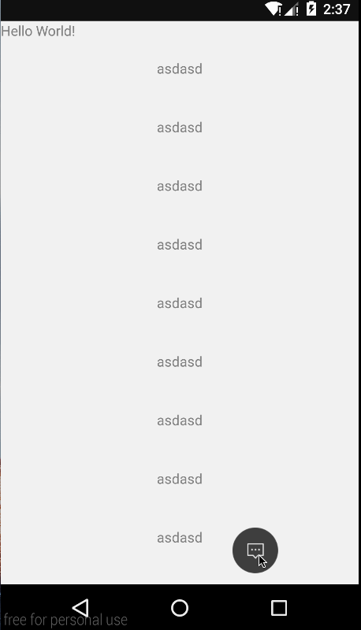
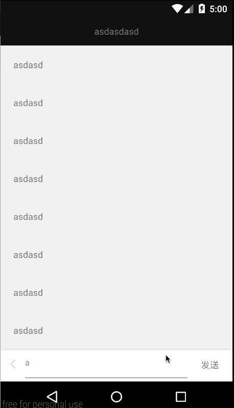
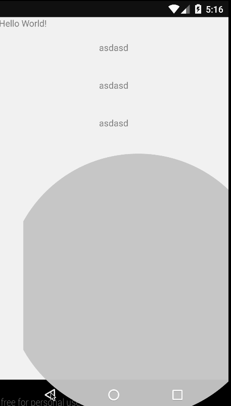
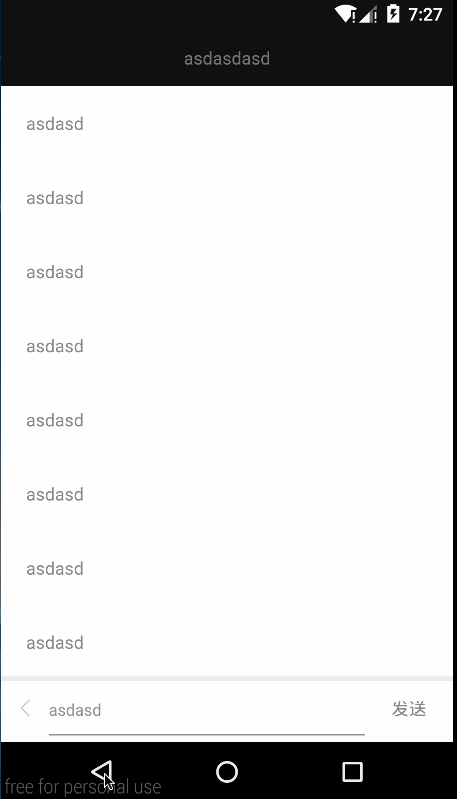

# 自定义 AndroidActivity 转场动画
在 Android 5.0上 google 官方给我提供了不少好看方便使用的专场动画

原生提供的普通转场动画
- fade 渐隐渐现
- slid 各元素先后滑动进入
- Explode 分裂成连个部分以前进入

分享元素的转场动画
- changeBound 这个是最长使用的 改变View 大小和位置
- changeClipBounds 改变 Clip 边界的大小
- changeImageTransform 改变ImageView 的大小 和 martix
- ChangeTransform 改变普通的 View 一些Scalex 值
- ChangeScroll 改变滑动位置

以上都是原生的. 但是面对一些复杂的转场动画,google 提供的这几个还是不够, 很多时候都需要自己定义转场动画.
例如下转场动画, 使用原生的这些动画很难实现:



###上面那个转场动画主要分为两部分:
1. 顶部 title bar 和底部输入框的 进入 返回动画
2. 第一个页面的评论圆球通过揭露效果显示到第二页面的内容详情页面


##第一个问题, 顶部 title bar 和顶部输入框进入,返回动画
一开始我想使用 官方元素的slid或Explode来实现, 但是基本都难以实现
后面只能自己写一个转场动画,转场动画也简单.
只需要继承 `Visibility` 或 `Transition` 其中 `Visibility`是继承自`Transition`的

如果转场动画只是某个 View 出现或消失, 那么可以考虑继承 `Visibility`
如果是累 ShareElem这样的转场动画, 那么就需要继承 `Transition`

回到重点, 我们需要实现 , 第一个问题:
> 顶部 title bar 和底部输入框的 进入 返回动画

继承`Visibility` 有4个方法需要我们重写:
1. `public void captureStartValues(TransitionValues transitionValues)` 这里保存计算动画初始状态的一个属性值
2. `public void captureEndValues(TransitionValues transitionValues)` 这里保存计算动画结束状态的一个属性值
3. `public Animator onAppear(ViewGroup sceneRoot, final View view, TransitionValues startValues, TransitionValues endValues)`
    如果是进入动画 即显示某个 View 则会执行这个方法
4. `public Animator onDisappear(ViewGroup sceneRoot, final View view, TransitionValues startValues, TransitionValues endValues)`
    如果是退出 , 即不在显示某个 VIew 则会执行这个方法
    
我们可以看到顶部 title bar 和 底部输入框 输入框的动画其实非常简单, 仅仅只有`TranslationY` 这一个动画.
我们只需要在`captureStartValues`,`captureEndValues`两个方法中分别计算和保存开始和解释位置需要的位移
然后在 `onAppear`和`onDisappear` 方法创建动画即可

具体请查看代码:
```
public class CommentEnterTransition extends Visibility {
    private static final String TAG = "CommentEnterTransition";

    private static final String PROPNAME_BOTTOM_BOX_TRANSITION_Y = "custom_bottom_box_enter_transition:change_transY:transitionY";
    private static final String PROPNAME_TOP_BAR_TRANSITION_Y = "custom_top_bar_transition:change_transY:transitionY";

    private View mBottomView;
    private View mTopBarView;
    private Context mContext;

    public CommentEnterTransition(Context context, View topBarView, View bottomView) {
        mBottomView = bottomView;
        mTopBarView = topBarView;
        mContext = context;
    }


    @Override
    public void captureStartValues(TransitionValues transitionValues) {
        super.captureStartValues(transitionValues);
        mBottomView.measure(0, 0);
        int transY = mBottomView.getMeasuredHeight();

        // 保存 计算初始值
        transitionValues.values.put(PROPNAME_BOTTOM_BOX_TRANSITION_Y, transY);
        transitionValues.values.put(PROPNAME_TOP_BAR_TRANSITION_Y, -mContext.getResources().getDimensionPixelOffset(R.dimen.top_bar_height));
    }

    @Override
    public void captureEndValues(TransitionValues transitionValues) {
        super.captureEndValues(transitionValues);

        // 保存计算结束值
        transitionValues.values.put(PROPNAME_BOTTOM_BOX_TRANSITION_Y, 0);
        transitionValues.values.put(PROPNAME_TOP_BAR_TRANSITION_Y, 0);
    }


    @Override
    public Animator createAnimator(ViewGroup sceneRoot, TransitionValues startValues, TransitionValues endValues) {
        return super.createAnimator(sceneRoot, startValues, endValues);

    }

    @Override
    public Animator onAppear(ViewGroup sceneRoot, final View view,
                             TransitionValues startValues, TransitionValues endValues) {

        if (null == startValues || null == endValues) {
            return null;
        }

        // 这里去除 之前 存储的 初始值 和 结束值, 然后执行东湖
        if (view == mBottomView) {
            int startTransY = (int) startValues.values.get(PROPNAME_BOTTOM_BOX_TRANSITION_Y);
            int endTransY = (int) endValues.values.get(PROPNAME_BOTTOM_BOX_TRANSITION_Y);

            if (startTransY != endTransY) {
                ValueAnimator animator = ValueAnimator.ofInt(startTransY, endTransY);
                // 注意这里不能使用 属性动画, 使用 ValueAnimator 然后在更新 View 的对应属性
                animator.addUpdateListener(new ValueAnimator.AnimatorUpdateListener() {
                    @Override
                    public void onAnimationUpdate(ValueAnimator animation) {
                        Object value = animation.getAnimatedValue();
                        if (null != value) {
                            view.setTranslationY((Integer) value);
                        }
                    }
                });
                return animator;
            }
        } else if (view == mTopBarView) {

            int startTransY = (int) startValues.values.get(PROPNAME_TOP_BAR_TRANSITION_Y);
            int endTransY = (int) endValues.values.get(PROPNAME_TOP_BAR_TRANSITION_Y);

            if (startTransY != endTransY) {
                ValueAnimator animator = ValueAnimator.ofInt(startTransY, endTransY);
                animator.addUpdateListener(new ValueAnimator.AnimatorUpdateListener() {
                    @Override
                    public void onAnimationUpdate(ValueAnimator animation) {
                        Object value = animation.getAnimatedValue();
                        if (null != value) {
                            view.setTranslationY((Integer) value);
                        }
                    }
                });
                return animator;
            }
        }
        return null;
    }

    @Override
    public Animator onDisappear(ViewGroup sceneRoot, final View view,
                                TransitionValues startValues, TransitionValues endValues) {
        if (null == startValues || null == endValues) {
            return null;
        }

        // 这里执行 返回动画,  这里金 初始值 和技术值 对调了,这样动画, 就就和原来动画想反了
        if (view == mBottomView) {
            int startTransY = (int) endValues.values.get(PROPNAME_BOTTOM_BOX_TRANSITION_Y);
            int endTransY = (int) startValues.values.get(PROPNAME_BOTTOM_BOX_TRANSITION_Y);

            if (startTransY != endTransY) {
                ValueAnimator animator = ValueAnimator.ofInt(startTransY, endTransY);
                animator.addUpdateListener(new ValueAnimator.AnimatorUpdateListener() {
                    @Override
                    public void onAnimationUpdate(ValueAnimator animation) {
                        Object value = animation.getAnimatedValue();
                        if (null != value) {
                            view.setTranslationY((Integer) value);
                        }
                    }
                });
                return animator;
            }
        } else if (view == mTopBarView) {
            int startTransY = (int) endValues.values.get(PROPNAME_TOP_BAR_TRANSITION_Y);
            int endTransY = (int) startValues.values.get(PROPNAME_TOP_BAR_TRANSITION_Y);

            if (startTransY != endTransY) {
                ValueAnimator animator = ValueAnimator.ofInt(startTransY, endTransY);
                animator.addUpdateListener(new ValueAnimator.AnimatorUpdateListener() {
                    @Override
                    public void onAnimationUpdate(ValueAnimator animation) {
                        Object value = animation.getAnimatedValue();
                        if (null != value) {
                            view.setTranslationY((Integer) value);
                        }
                    }
                });
                return animator;
            }
        }
        return null;
    }
}

```


最后把自定义的转场动画设置上即可:
```
getWindow().setEnterTransition(new CommentEnterTransition(this, mTitleBarTxt, mBottomSendBar));
```

再看看效果:




## 第二个问题, 分享元素的揭露展开以及收缩动画
首先一点可以明确指示一个分享元素的转场动画, 
一开始想用原始的 ChangeBounds 来简单实现但是有一个问题就是从圆形变成矩形的这个过程太过生硬
后来没办法只能自己自动转存动画.

我们在来分析看看上面的那个转场动画
1. 揭露效果: 从第一个页面的圆球开始, 圆球慢慢的方法, 直到整个动画结束
2. 看似 View 是在随着动画的过程慢慢放大
3. 似乎还有曲线位移的动画?

其实如果真的自己写过转场动画的话, 第二个可以排除了, 分享元素的转场动画一开始 view 就已经变成第二个页面中的View 了, 所以 View 没有放大过程
ok 我们首先来解决第一个问题, 揭露动画. 这个是 Android 5.0 以后原生提供的一个动画使用起来特别简单:
```
ViewAnimationUtils.createCircularReveal(view, centerX, centerY,startRadius, endRadius);
```

其中 
`centerX`, `centerY`是揭露动画圆心的位置;
`startRadius`, `endRadius`则是开始时圆球的半径 和结束时圆球的半径

那么加来我们就需要 继承 `Transition` 来实现揭露动画了.
继承 `Transition` 需要重写以下 3个方法:
1. `public void captureStartValues(TransitionValues transitionValues)` 这里能够获取到 上一个页面的对应的 View 一些属性值
2. `public void captureEndValues(TransitionValues transitionValues)` 这里能够获取到 即将要打开的对应的页面的对应 View 的一些属性值
3. `public Animator createAnimator(ViewGroup sceneRoot, TransitionValues startValues, TransitionValues endValues)` 这里创建对应的转场动画


ok, 那么为了实现 上面的揭露动画, 我们需要一开始获取的值有:
1. 上一个页面的圆形 View 的宽度, 作为揭露动画圆形的最开始的半径
2. 即将要打开的页面的 对应 View 的对角线的长度, 作为揭露动画圆形的最终半径
3. 获取揭露动画的圆心位置, 这里我们去 View 的中间位置

ok 那么就可实现一个简单的转场揭露动画了, 先看看代码, 然后再看看效果
代码:
```
public class ShareElemEnterRevealTransition extends Transition {
    private static final String TAG = "ShareElemEnterRevealTransition";

    private static final String PROPNAME_RADIUS = "custom_reveal:change_radius:radius";

    private boolean hasAnim = false;

    private View animView;

    public ShareElemEnterRevealTransition(View animView) {
        this.animView = animView;
    }

    @Override
    public void captureStartValues(TransitionValues transitionValues) {
        transitionValues.values.put(PROPNAME_RADIUS, transitionValues.view.getWidth() / 2);
    }

    @Override
    public void captureEndValues(TransitionValues transitionValues) {
        View view = transitionValues.view;
        float widthSquared = view.getWidth() * view.getWidth();
        float heightSquared = view.getHeight() * view.getHeight();
        int radius = (int) Math.sqrt(widthSquared + heightSquared) / 2;
        transitionValues.values.put(PROPNAME_RADIUS, radius);
    }

    @Override
    public Animator createAnimator(ViewGroup sceneRoot, TransitionValues startValues, TransitionValues endValues) {

        if (null == startValues || null == endValues) {
            return null;
        }
        final View view = endValues.view;
        int startRadius = (int) startValues.values.get(PROPNAME_RADIUS);
        int endRadius = (int) endValues.values.get(PROPNAME_RADIUS);

        if (view == animView) {
            Animator reveal = createAnimator(view, startRadius, endRadius);
            hasAnim = true;
            return reveal;
        }

        return null;
    }

    private Animator createAnimator(View view, float startRadius, float endRadius) {
        int centerX = view.getWidth() / 2;
        int centerY = view.getHeight() / 2;
        Animator reveal = ViewAnimationUtils.createCircularReveal(view, centerX, centerY,
                startRadius, endRadius);
        return new NoPauseAnimator(reveal);
    }
}
```

效果:



貌似差距有点大,没有颜色的渐变, 同时貌似接通动画的圆形是在第二页面 View 的圆心, 没有移动的感觉
ok , 接下来需要处理的有: 
1. 移动 View
2. 背景颜色渐变

通过上面的代码示例, 做这两件事情应该不复杂, 下面直接上代码:

改变颜色:
```
public class ChangeColor extends Transition {
    private static final String TAG = "ChangeColor";

    private static final String PROPNAME_BACKGROUND = "customtransition:change_color:backgroundcolor";


    int mStartColor;
    int mEndColor;

    public ChangeColor(int startColor, int endColor) {
        this.mStartColor = startColor;
        this.mEndColor = endColor;
    }

    private void captureValues(TransitionValues values) {
        values.values.put(PROPNAME_BACKGROUND, values.view.getBackground());
    }

    @Override
    public void captureStartValues(TransitionValues transitionValues) {
        captureValues(transitionValues);
        transitionValues.values.put(PROPNAME_BACKGROUND, mStartColor);
    }

    @Override
    public void captureEndValues(TransitionValues transitionValues) {
        transitionValues.values.put(PROPNAME_BACKGROUND, mEndColor);
    }

    @Override
    public Animator createAnimator(ViewGroup sceneRoot,
                                   TransitionValues startValues, TransitionValues endValues) {
        if (null == startValues || null == endValues) {
            return null;
        }
        final View view = endValues.view;

        int startColor = (int) startValues.values.get(PROPNAME_BACKGROUND);
        int endColor = (int) endValues.values.get(PROPNAME_BACKGROUND);

        if (startColor != endColor) {
            ValueAnimator animator = ValueAnimator.ofObject(new ArgbEvaluator(), startColor, endColor);
            animator.addUpdateListener(new ValueAnimator.AnimatorUpdateListener() {
                @Override
                public void onAnimationUpdate(ValueAnimator animation) {
                    Object value = animation.getAnimatedValue();
                    if (null != value) {
                        view.setBackgroundColor((Integer) value);
                    }
                }
            });
            return animator;
        }
        return null;
    }
}

```

改变位置(曲线运动):

```
public class ChangePosition extends Transition {
    private static final String TAG = "ChangePosition";

    private static final String PROPNAME_POSITION = "custom_position:change_position:position";


    public ChangePosition() {
        // 这里通过曲线的方式 来改变位置
        setPathMotion(new PathMotion() {
            @Override
            public Path getPath(float startX, float startY, float endX, float endY) {
                Path path = new Path();
                path.moveTo(startX, startY);

                float controlPointX = (startX + endX) / 3;
                float controlPointY = (startY + endY) / 2;

                // 这里是一条贝塞尔曲线的路基, (controlPointX, controlPointY) 表示控制点
                path.quadTo(controlPointX, controlPointY, endX, endY);
                return path;
            }
        });
    }

    private void captureValues(TransitionValues values) {
        values.values.put(PROPNAME_POSITION, values.view.getBackground());

        Rect rect = new Rect();
        values.view.getGlobalVisibleRect(rect);
        values.values.put(PROPNAME_POSITION, rect);
    }


    @Override
    public void captureStartValues(TransitionValues transitionValues) {
        captureValues(transitionValues);
    }

    @Override
    public void captureEndValues(TransitionValues transitionValues) {
        captureValues(transitionValues);
    }

    @Override
    public Animator createAnimator(ViewGroup sceneRoot,
                                   TransitionValues startValues, TransitionValues endValues) {
        if (null == startValues || null == endValues) {
            return null;
        }

        if (startValues.view.getId() > 0) {
            Rect startRect = (Rect) startValues.values.get(PROPNAME_POSITION);
            Rect endRect = (Rect) endValues.values.get(PROPNAME_POSITION);

            final View view = endValues.view;

            Path changePosPath = getPathMotion().getPath(startRect.centerX(), startRect.centerY(), endRect.centerX(), endRect.centerY());

            int radius = startRect.centerY() - endRect.centerY();

            ObjectAnimator objectAnimator = ObjectAnimator.ofObject(view, new PropPosition(PointF.class, "position", new PointF(endRect.centerX(), endRect.centerY())), null, changePosPath);
            objectAnimator.setInterpolator(new FastOutSlowInInterpolator());

            return objectAnimator;
        }
        return null;

    }

    static class PropPosition extends Property<View, PointF> {

        public PropPosition(Class<PointF> type, String name) {
            super(type, name);
        }

        public PropPosition(Class<PointF> type, String name, PointF startPos) {
            super(type, name);
            this.startPos = startPos;
        }

        PointF startPos;

        @Override
        public void set(View view, PointF topLeft) {

            int x = Math.round(topLeft.x);
            int y = Math.round(topLeft.y);

            int startX = Math.round(startPos.x);
            int startY = Math.round(startPos.y);

            int transY = y - startY;
            int transX = x - startX;

            // 这里控制 View 移动
            view.setTranslationX(transX);
            view.setTranslationY(transY);
        }

        @Override
        public PointF get(View object) {
            return null;
        }
    }

}

```

上面改变位置的 使用 Path 动画, 使得 View 能够以贝塞尔曲线的方式进行位移

ok 上面基本上就把 enter 的动画处理完了, 但是返回还是有点问题.
看下图:


返回的时候 View 大小已经变成了后面个页面 View 的大小了, 然后由于大小的限制揭露动画基本也看不出效果.
所以分享元素的返回动画我们也要做一些细微的调整.

关于改变 View大小的这个问题, 我看了下 ChangeBounds 的源码, 然后发现, 他们是通过调用 View一个隐藏方法:
```
/**
 * Same as setFrame, but public and hidden. For use in {@link android.transition.ChangeBounds}.
 * @hide
 */
public void setLeftTopRightBottom(int left, int top, int right, int bottom) {
    setFrame(left, top, right, bottom);
}
```

后面发现有适配问题, 这个方法只在5.1或以上才有, 在5.0 上面没有, 然后又看了下 5.0 的ChangeBounds 源码, 发现在 5.0 上改变 View 大小是通过以下方式实现的:
```
view.setLeft(left);
view.setRight(right);
view.setTop(top);
view.setBottom(bottom);
```

额 其实 5.0 的这个 set 方法在 5.1或以上也是可以使用的. 
所以改变 View 大小这个, 可以选择 5.1 以上用反射 调用 setLeftTopRightBottom 方法, 也可以选择 都直接使用set 方法

下面贴上返回动画一些代码:
改变位置:
```
public class ShareElemReturnChangePosition extends Transition {
    private static final String TAG = "ShareElemReturnChangePosition";

    private static final String PROPNAME_POSITION = "custom_position:change_position:position";


    public ShareElemReturnChangePosition() {
        setPathMotion(new PathMotion() {
            @Override
            public Path getPath(float startX, float startY, float endX, float endY) {
                Path path = new Path();
                path.moveTo(startX, startY);

                float controlPointX = (startX + endX) / 3;
                float controlPointY = (startY + endY) / 2;

                path.quadTo(controlPointX, controlPointY, endX, endY);
                return path;
            }
        });
    }

    private void captureValues(TransitionValues values) {
        values.values.put(PROPNAME_POSITION, values.view.getBackground());

        Rect rect = new Rect();
        values.view.getGlobalVisibleRect(rect);
        values.values.put(PROPNAME_POSITION, rect);
    }


    @Override
    public void captureStartValues(TransitionValues transitionValues) {
        captureValues(transitionValues);
    }

    @Override
    public void captureEndValues(TransitionValues transitionValues) {
        captureValues(transitionValues);
    }

    @Override
    public Animator createAnimator(ViewGroup sceneRoot,
                                   TransitionValues startValues, TransitionValues endValues) {
        if (null == startValues || null == endValues) {
            return null;
        }

        if (startValues.view.getId() > 0) {
            Rect startRect = (Rect) startValues.values.get(PROPNAME_POSITION);
            Rect endRect = (Rect) endValues.values.get(PROPNAME_POSITION);

            final View view = endValues.view;


            Rect rect = new Rect();
            view.getGlobalVisibleRect(rect);

            Path changePosPath = getPathMotion().getPath(startRect.centerX(), startRect.centerY(), endRect.centerX(), endRect.centerY() - endRect.height() / 2);

            ObjectAnimator objectAnimator = ObjectAnimator.ofObject(view, new PropPosition(PointF.class, "position", new PointF(startRect.centerX(), startRect.centerY())), null, changePosPath);
            objectAnimator.setInterpolator(new FastOutSlowInInterpolator());

            return objectAnimator;
        }
        return null;

    }

    static class PropPosition extends Property<View, PointF> {

        public PropPosition(Class<PointF> type, String name) {
            super(type, name);
        }

        public PropPosition(Class<PointF> type, String name, PointF startPos) {
            super(type, name);
            this.startPos = startPos;
        }

        PointF startPos;

        @Override
        public void set(View view, PointF topLeft) {

            int x = Math.round(topLeft.x);
            int y = Math.round(topLeft.y);

            int startX = Math.round(startPos.x);
            int startY = Math.round(startPos.y);

            int transY = y - startY;
            int transX = x - startX;

            Rect rect = new Rect();
            view.getGlobalVisibleRect(rect);

            view.setTranslationX(transX);
            view.setTranslationY(transY);
        }

        @Override
        public PointF get(View object) {
            return null;
        }
    }
}
```

揭露动画:
```
public class ShareElemReturnRevealTransition extends Transition {
    private static final String TAG = "ShareElemReturnRevealTransition";

    private static final String PROPNAME_BACKGROUND = "custom_reveal:change_radius:radius";

    private boolean hasAnim = false;

    private View animView;

    private Rect startRect;
    private Rect endRect;


    public ShareElemReturnRevealTransition(View animView) {
        this.animView = animView;
        startRect = new Rect();
        endRect = new Rect();
    }

    @Override
    public void captureStartValues(TransitionValues transitionValues) {
        View view = transitionValues.view;
        float widthSquared = view.getWidth() * view.getWidth();
        float heightSquared = view.getHeight() * view.getHeight();
        int radius = (int) Math.sqrt(widthSquared + heightSquared) / 2;

        transitionValues.values.put(PROPNAME_BACKGROUND, radius);
        transitionValues.view.getGlobalVisibleRect(startRect);

    }

    @Override
    public void captureEndValues(TransitionValues transitionValues) {
        transitionValues.view.getLocalVisibleRect(endRect);

        transitionValues.values.put(PROPNAME_BACKGROUND, transitionValues.view.getWidth() / 2);
    }

    @Override
    public Animator createAnimator(ViewGroup sceneRoot, TransitionValues startValues, final TransitionValues endValues) {

        if (null == startValues || null == endValues) {
            return null;
        }

        final View view = endValues.view;
        int startRadius = (int) startValues.values.get(PROPNAME_BACKGROUND);
        int endRadius = (int) endValues.values.get(PROPNAME_BACKGROUND);

        // 在执行返回动画的时候,  View 默认的被控制 为 前一个页面的 ShareElem 的打消了
        // 所以这里 需要改变的 View 大小 才能 正常的使用揭露动画
        // 反射调用
        relfectInvoke(view,
                startRect.left,
                startRect.top,
                startRect.right,
                startRect.bottom
        );

        Animator reveal = createAnimator(view, startRadius, endRadius);

        // 在动画的最后 被我们放大后的 View 会闪一些  这里可以有防止那种情况发生
        reveal.addListener(new AnimatorListenerAdapter() {
            @Override
            public void onAnimationEnd(Animator animation) {
                super.onAnimationEnd(animation);
                view.setClipBounds(new Rect(0, 0, 1, 1));
                view.setVisibility(View.GONE);
            }
        });
        return reveal;

    }

    private Animator createAnimator(View view, float startRadius, float endRadius) {
        int centerX = view.getWidth() / 2;
        int centerY = view.getHeight() / 2;

        Animator reveal = ViewAnimationUtils.createCircularReveal(view, centerX, centerY,
                startRadius, endRadius);
        return new ShareElemEnterRevealTransition.NoPauseAnimator(reveal);
    }

    // setLeftTopRightBottom 需要反射执行, 该方法能够控制 View 的大小以及位置 在 ChangeBounds 类中有调用
    private void relfectInvoke(View view, int left, int top, int right, int bottom) {

        Class clazz = view.getClass();
        try {
            Method m1 = clazz.getMethod("setLeftTopRightBottom", new Class[]{int.class, int.class, int.class, int.class});
            m1.invoke(view, left, top, right, bottom);
        } catch (Exception e) {
            e.printStackTrace();

            // 5.0版本  没有 setLeftTopRightBottom 这个方法  使用一下方法 ,额 其实 5.0 以上也可以用这些方法?
            view.setLeft(left);
            view.setRight(right);
            view.setTop(top);
            view.setBottom(bottom);
        }

    }

}

```

ok 下面贴上 Activity 中如何使用这些动画:

```
public class CommentActivity extends AppCompatActivity {

    private static final String TAG = "CommentActivity";


    View mBottomSendBar;
    View mTitleBarTxt;
    View mCommentBox;


    @Override
    protected void onCreate(Bundle savedInstanceState) {
        super.onCreate(savedInstanceState);
        setContentView(R.layout.activity_coment);
        mCommentBox = findViewById(R.id.comment_box);
        mTitleBarTxt = findViewById(R.id.txt_title_bar);
        mBottomSendBar = findViewById(R.id.bottom_send_bar);

        setTransition();

    }

    private void setTransition() {
        // 顶部 title 和底部输入框的进入动画
        getWindow().setEnterTransition(new CommentEnterTransition(this, mTitleBarTxt, mBottomSendBar));

        getWindow().setSharedElementEnterTransition(buildShareElemEnterSet());
        getWindow().setSharedElementReturnTransition(buildShareElemReturnSet());

    }

    /**
     * 分享 元素 进入动画
     * @return
     */
    private TransitionSet buildShareElemEnterSet() {
        TransitionSet transitionSet = new TransitionSet();

        Transition changePos = new ChangePosition();
        changePos.setDuration(300);
        changePos.addTarget(R.id.comment_box);
        transitionSet.addTransition(changePos);

        Transition revealTransition = new ShareElemEnterRevealTransition(mCommentBox);
        transitionSet.addTransition(revealTransition);
        revealTransition.addTarget(R.id.comment_box);
        revealTransition.setInterpolator(new FastOutSlowInInterpolator());
        revealTransition.setDuration(300);

        ChangeColor changeColor = new ChangeColor(getResources().getColor(R.color.black_85_alpha), getResources().getColor(R.color.white));
        changeColor.addTarget(R.id.comment_box);
        changeColor.setDuration(350);

        transitionSet.addTransition(changeColor);

        transitionSet.setDuration(900);

        return transitionSet;
    }

    /**
     * 分享元素返回动画
     * @return
     */
    private TransitionSet buildShareElemReturnSet() {
        TransitionSet transitionSet = new TransitionSet();

        Transition changePos = new ShareElemReturnChangePosition();
        changePos.addTarget(R.id.comment_box);
        transitionSet.addTransition(changePos);

        ChangeColor changeColor = new ChangeColor(getResources().getColor(R.color.white), getResources().getColor(R.color.black_85_alpha));
        changeColor.addTarget(R.id.comment_box);
        transitionSet.addTransition(changeColor);


        Transition revealTransition = new ShareElemReturnRevealTransition(mCommentBox);
        revealTransition.addTarget(R.id.comment_box);
        transitionSet.addTransition(revealTransition);

        transitionSet.setDuration(900);

        return transitionSet;
    }
}
```


##结语
ok 关于自定义过场动画基本就说完了
这里没有将具体如果使用过场动画, 也没有有说 EnterTransition 和 ReturnTransition 这些关系什么的,
还有如何最基本使用过场动画什么的, 这些Android 官网上都有中文文档, 就不多提了

### [github 项目连接](https://github.com/crianzy/CustomAndroidActivityTransition)


